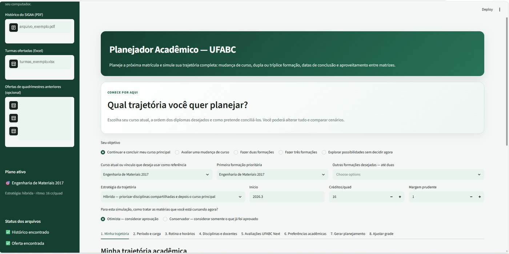
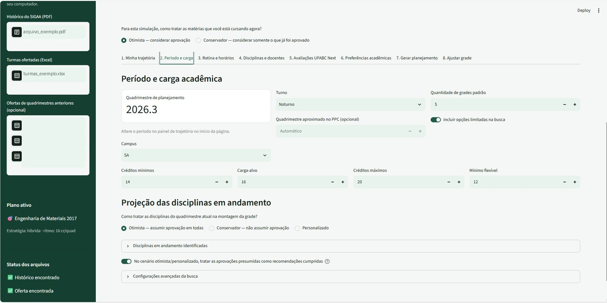
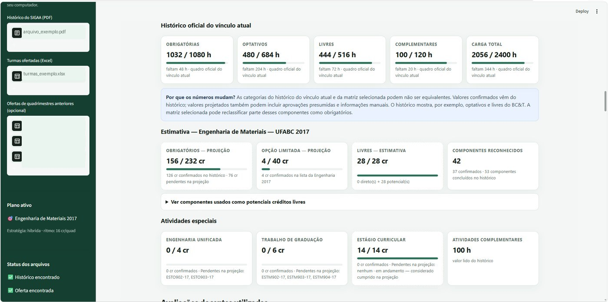
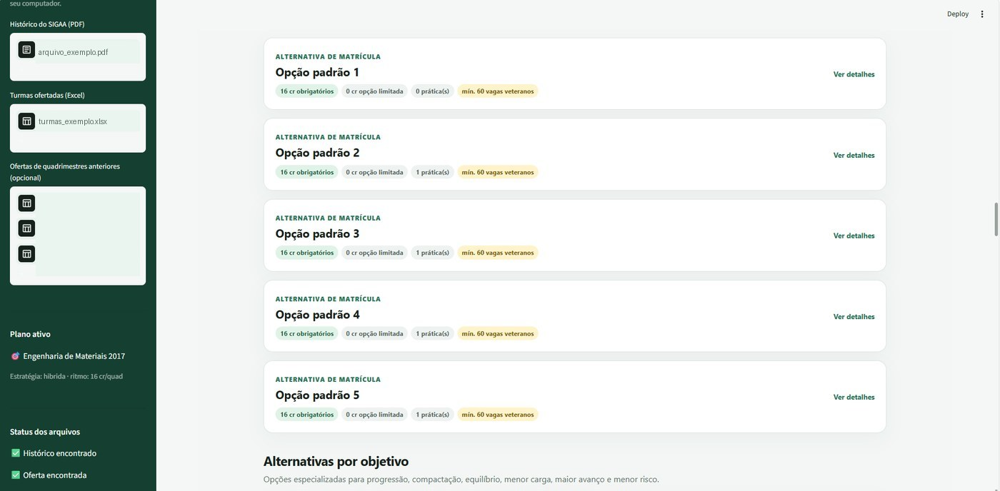

# 🎓 UFABC Academic Planner

Aplicação em **Python + Streamlit** para apoiar estudantes da Universidade Federal do ABC na montagem da próxima grade e na simulação de trajetórias acadêmicas mais longas.

O projeto nasceu de um problema real: na UFABC, o sistema quadrimestral, as diferentes matrizes, equivalências, recomendações, horários e possibilidades de múltiplas formações tornam o planejamento acadêmico um problema combinatório difícil de resolver manualmente.

> **Status:** versão funcional de portfólio. A aplicação roda localmente e a suíte atual possui **47 testes automatizados**.



## O que o projeto faz

O planejador combina informações do histórico acadêmico, currículos e turmas ofertadas para gerar alternativas de matrícula e apoiar decisões sobre progressão curricular.

Entre as funcionalidades implementadas estão:

- leitura do histórico acadêmico em PDF;
- processamento de turmas ofertadas em Excel;
- identificação de componentes concluídos, em andamento e pendentes;
- análise de obrigatórias, opções limitadas e créditos livres;
- tratamento de equivalências entre matrizes;
- detecção de conflitos de horário, inclusive aulas quinzenais;
- geração de múltiplas grades viáveis;
- ranking por diferentes objetivos, como progressão, compactação, equilíbrio e risco;
- busca com validação de cobertura e fronteira de Pareto;
- comparação entre currículos;
- simulação de mudança de curso, dupla ou múltipla formação;
- estimativas de conclusão e gargalos acadêmicos;
- relatórios em HTML;
- integração opcional com avaliações docentes, mantida desabilitada por padrão na versão pública.

## Interface

### Configuração do período e da carga

O usuário consegue definir campus, turno, quantidade de créditos e como disciplinas em andamento devem ser consideradas.



### Integralização e projeção curricular

A aplicação separa os dados oficiais do histórico da reclassificação feita para a matriz selecionada, evitando misturar categorias que podem ter regras diferentes.



### Alternativas de matrícula

Em vez de retornar apenas a primeira combinação encontrada, o sistema mantém diferentes soluções para comparação.



## Como a busca funciona

O problema é tratado como uma busca combinatória com restrições. Cada candidata é filtrada por regras acadêmicas e logísticas e depois avaliada por múltiplos critérios.

A aplicação considera, entre outros fatores:

- conflito de horários;
- quantidade de créditos;
- prioridade curricular;
- recomendações acadêmicas;
- aulas práticas;
- janelas entre aulas;
- número de dias no campus;
- disponibilidade de vagas quando informada;
- preferências configuradas pelo usuário.

O sistema também informa se a busca percorreu todo o espaço viável analisado ou se algum limite técnico afetou a cobertura.

## Trajetórias acadêmicas

Além da matrícula do próximo quadrimestre, o projeto consegue comparar trajetórias com uma, duas ou três formações. O cálculo reclassifica o histórico em cada matriz, identifica sobreposições e estima os créditos ainda necessários.

As projeções são **estimativas de apoio à decisão**. Elas não substituem o SIGAA, os PPCs ou orientações oficiais da universidade e não pressupõem que disciplinas serão ofertadas no futuro.

## Tecnologias

**Aplicação e dados:** `Python`, `Streamlit`, `Pandas`, `OpenPyXL`, `PDFPlumber`, `JSON`, `Excel`

**Automação e integração:** `Playwright`

**Qualidade:** `Pytest`, testes de regras acadêmicas e testes de integração

**Versionamento:** `Git`, `GitHub`

## Estrutura do projeto

```text
planejador-academico-ufabc/
├── app.py
├── main.py
├── requirements.txt
├── config/
├── dados/
│   └── curriculos/
├── entradas/
├── ferramentas/
├── planejador/
├── saidas/
├── tests/
└── assets/
```

A pasta `planejador/` concentra as regras de domínio e a lógica principal; `app.py` contém a interface Streamlit; `tests/` contém a suíte automatizada.

## Como executar

Requer Python 3.10+.

```bash
git clone https://github.com/sobralsons/planejador-academico-ufabc.git
cd planejador-academico-ufabc

python -m venv .venv
```

No Windows:

```bash
.venv\Scripts\activate
pip install -r requirements.txt
streamlit run app.py
```

Também é possível usar `executar_windows.bat`.

## Testes

```bash
python -m pytest -q
```

Na versão auditada para publicação, a suíte executa **47 testes**, cobrindo regras de horários, histórico, equivalências, currículos, busca, ranking, planejamento multicurso e trajetórias.

## Privacidade

O repositório público **não inclui histórico acadêmico pessoal, arquivos de matrícula do usuário, sessão autenticada, credenciais nem comentários integrais de avaliações docentes**.

Arquivos enviados pela interface são processados localmente e estão cobertos pelo `.gitignore`.

A integração opcional com o UFABC Next deve ser usada de forma consciente e respeitando os termos e permissões aplicáveis ao serviço. Nenhuma avaliação docente real é distribuída nesta versão pública.

## Limitações

- projeções futuras dependem de hipóteses e não garantem oferta de disciplinas;
- regras acadêmicas podem mudar e devem ser confirmadas em fontes oficiais;
- número de vagas e docentes podem mudar a cada quadrimestre;
- estimativas de conclusão não substituem análise oficial da universidade.

## Próximos passos

A evolução técnica planejada inclui separar a aplicação em API e frontend, persistir dados em banco relacional e adicionar uma camada de testes/CI mais completa. Tecnologias em estudo para essa evolução incluem **FastAPI, PostgreSQL, Docker e GitHub Actions**.

---

Projeto pessoal desenvolvido como exercício de **engenharia de software, análise de dados, modelagem de regras e otimização aplicada a um problema real**.
